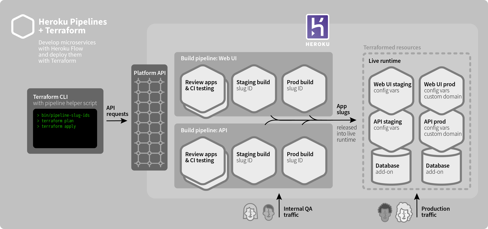

# Deploy Heroku apps from pipelines using Terraform

[Heroku Pipelines](https://devcenter.heroku.com/articles/pipelines) provide a continuous delivery workflow for Heroku apps, supporting [Review Apps](https://devcenter.heroku.com/articles/github-integration-review-apps), [CI testing](https://devcenter.heroku.com/articles/heroku-ci), and [automated deployment](https://devcenter.heroku.com/articles/github-integration#automatic-deploys).

When used in conjunction with Terraform, **Pipelines act as the build system**, generating slugs to be released by a Terraform config. The apps in the pipeline do not serve live production traffic. Instead, the apps provisioned by Terraform are the production system.

A single [Terraform config](https://www.terraform.io/docs/configuration/index.html) embodies the complete system, enabling high-level collaboration, repeatability, test-ability, and change management.



## Primary components

* [Heroku](https://www.heroku.com/home) provides the primatives: Apps and Add-ons
* [Terraform](https://terraform.io) provides declarative, unified systems configuration with support for over 120 providers, a human-friendly configuration as code format, and a deterministic provisioning engine
* **Pipeline-to-Terraform connector**, a custom solution, for example this [`bin/pipeline-slug-ids`](bin/pipeline-slug-ids) script

## Challenges & Caveats

* **Config drift when using Heroku Dashboard or CLI.** Once the config is applied, if changes are made to the resources outside of Terraform, such as scaling dynos, setting config vars, changing add-ons, etc, then the Terraform state will no longer match its configuration, making it impossible to apply or destroy further until the drifting values are imported (for new resources) or manually updated in `terraform.tfstate`
* **Renaming Terraform-provisioned Heroku apps.** If apps are renamed, Terraform can no longer access various resources without first manually editing, revising `terraform.tfstate` with the new names. See **terraform-provider-heroku** issues [#124](https://github.com/terraform-providers/terraform-provider-heroku/issues/124) & [#93](https://github.com/terraform-providers/terraform-provider-heroku/issues/93)

## Requirements

* [Heroku](https://www.heroku.com/home)
  * install [command-line tools (CLI)](https://toolbelt.heroku.com)
  * [an account](https://signup.heroku.com) (must be a member of an Enterprise account for access to Private Spaces)
* install [git](https://git-scm.com/book/en/v2/Getting-Started-Installing-Git)
* install [Terraform](https://terraform.io)

## Usage

Ensure the [requirements](#user-content-requirements) are met, then,

1. Clone this repo:

    ```bash
    git clone git@github.com:mars/terraform-heroku-pipeline-slugs.git
    cd terraform-heroku-pipeline-slugs/
    ```
2. Set Heroku API key
    1. `heroku authorizations:create -d terraform-heroku-pipeline-slugs`
    2. `export HEROKU_API_KEY=<"Token" value from the authorization>`
2. Set Heroku Pipeline IDs from which to capture the slugs
    * For each desired pipeline, set its UUID (from its Heroku Dashboard URL)
      into an environment variable, and then source the pipeline-slug-ids
      script, like this:

      ```bash
      export BUILD_PIPELINE_API=2f557b76-d685-452a-8651-9a6295a2a032
      export BUILD_PIPELINE_WEB_UI=26a3ecbf-8188-43ae-b0fe-be2d9e9fe26f
      source bin/pipeline-slug-ids
      ```
3. `terraform init`
4. Then, apply the config with your own top-level config values:

    ```bash
    source bin/pipeline-slug-ids
    terraform apply
    ```

-----

🔬 This is a community proof-of-concept, [MIT license](LICENSE), provided "as is", without warranty of any kind.
